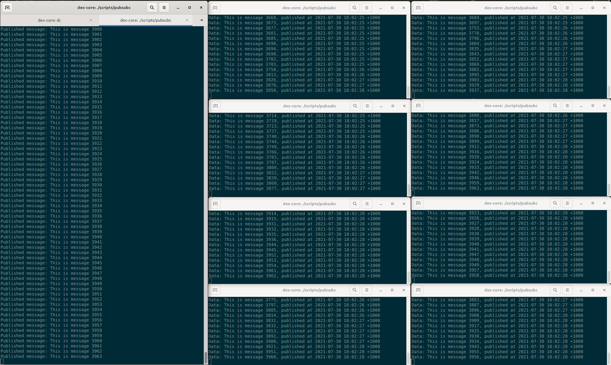

# pubsubc

[](https://github.com/ZimbiX/pubsubc/actions/workflows/main.yml) [](https://rubygems.org/gems/pubsubc)

A simple command-line client for [Google Cloud Pub/Sub](https://cloud.google.com/pubsub).

Unlike the `gcloud pubsub` utility, `pubsubc`:

- Supports the [Pub/Sub emulator](https://cloud.google.com/pubsub/docs/emulator)
- Provides a continuous subscribe command - to see all messages as they come in

Since this was originally created as a learning exercise for integrating to Pub/Sub, the source code should be simple enough for you to copy and adapt into your own application.

## Contents

<!-- MarkdownTOC autolink=true -->

- [Intro](#intro)
- [Installation](#installation)
  - [Direct](#direct)
  - [Bundler](#bundler)
- [Usage](#usage)
  - [Subscribe](#subscribe)
  - [Publish message](#publish-message)
  - [Publish generated messages](#publish-generated-messages)
- [Example](#example)
  - [Communicating some messages](#communicating-some-messages)
  - [Publishing from a message generator with several subscribers](#publishing-from-a-message-generator-with-several-subscribers)
- [Help info](#help-info)
- [Contributing](#contributing)
- [Development](#development)
  - [Pub/Sub emulator](#pubsub-emulator)
  - [Pre-push hook](#pre-push-hook)
  - [Release](#release)

<!-- /MarkdownTOC -->

## Intro

Features:

- Subscribe to a topic, continuously logging all messages as they arrive
- Publish a string message to a topic (creating a subscription automatically)
- Publish automatically-generated messages continuously at a given interval
- Supports connecting to either a local emulator or the remote real Pub/Sub

## Installation

The executable is distributed through RubyGems.

### Direct

You can install it to your system directly using:

```bash
gem install pubsubc
```

And then if you're using rbenv:

```bash
rbenv rehash
```

You can then run it with:

```bash
pubsubc
```

### Bundler

Or, just add it to the `Gemfile` of your project:

```ruby
gem 'pubsubc'
```

And then run it with:

```bash
bundle exec pubsubc
```

## Usage

### Subscribe

To subscribe and continuously log all messages from the topic:

```bash
pubsubc sub
```

### Publish message

To publish a single message to the topic:

```bash
pubsubc pub msg "G'day"
```

### Publish generated messages

To publish a generated message to the topic every second:

```bash
pubsubc pub gen --interval 1000
```

## Example

### Communicating some messages

```
➜ pubsubc pub msg "Sup wigga"    
Initialising Pub/Sub client for emulator (localhost:8085)... done
Checking existence of topic 'my-topic'... creating... done
Checking existence of subscription 'my-subscription'... creating... done
Published message: Sup wigga

➜ pubsubc pub msg "Yo J-dog" 
Initialising Pub/Sub client for emulator (localhost:8085)... done
Checking existence of topic 'my-topic'... exists
Checking existence of subscription 'my-subscription'... exists
Published message: Yo J-dog

➜ pubsubc sub                
Initialising Pub/Sub client for emulator (localhost:8085)... done
Checking existence of topic 'my-topic'... exists
Checking existence of subscription 'my-subscription'... exists
Listening for messages
Data: Sup wigga, published at 2021-07-30 23:19:06 +1000
Data: Yo J-dog, published at 2021-07-30 23:19:41 +1000
^C
```

### Publishing from a message generator with several subscribers



The generator was run with:

```bash
pubsubc pub gen --interval 1
```

And each subscriber:

```bash
pubsubc sub
```

## Help info

Output of `pubsubc --help`:

<!-- Help -->

```
Usage:
    pubsubc [OPTIONS] SUBCOMMAND [ARG] ...

  A simple command-line client for Google Cloud Pub/Sub.

  Created as a learning exercise, but also useful since the 'gcloud pubsub' commands don't support the emulator, and it doesn't provide a continuous subscribe command.

  To clean up:

      gcloud pubsub topics delete my-topic
      gcloud pubsub subscriptions delete my-subscription

Parameters:
    SUBCOMMAND                          subcommand
    [ARG] ...                           subcommand arguments

Subcommands:
    pub                                 Publishing messages to the topic
    sub                                 Subscribe to messages on the topic
    shell                               Get a Ruby shell to interact with Pub/Sub

Options:
    --topic TOPIC_NAME                  The name of the Pub/Sub topic (default: "my-topic")
    --subscription SUBSCRIPTION_NAME    The name of the Pub/Sub subscription within the topic (default: "my-subscription")
    --remote                            Connect to the real Pub/Sub, rather than a local Pub/Sub emulator
    --emulator-host EMULATOR_HOST       The host and port of the Pub/Sub emulator (default: $PUBSUB_EMULATOR_HOST, or "localhost:8085")
    -h, --help                          print help
```

<!-- /Help -->

Suffix `--help` to any subcommand to see the usage info for it.

## Contributing

Pull requests welcome! =)

However, I don't intend to duplicate functionality that exists in the `gcloud pubsub` utility, unless it's an improvement over what's in that.

## Development

### Pub/Sub emulator

To run the Pub/Sub emulator (with Docker):

```bash
docker-compose up -d pubsub-emulator
```

### Pre-push hook

This hook runs style checks and tests.

To set up the pre-push hook:

```bash
echo -e "#\!/bin/bash\n\$(dirname \$0)/../../auto/pre-push-hook" > .git/hooks/pre-push
chmod +x .git/hooks/pre-push
```

### Release

To release a new version:

```bash
auto/release/update-version && auto/release/tag && auto/release/publish
```

This takes care of the whole process:

- Incrementing the version number (the patch number by default)
- Tagging & pushing commits
- Publishing the gem to RubyGems
- Creating a draft GitHub release

To increment the minor or major versions instead of the patch number, run `auto/release/update-version` with `--minor` or `--major`.
